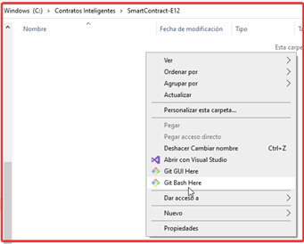
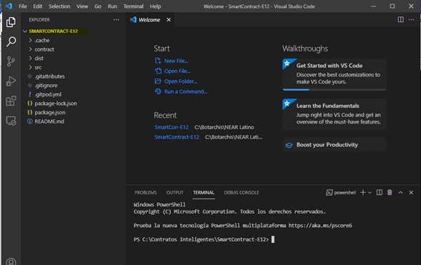

# Consignación de activos.

## Acerca del proyecto:

Creación de contratos inteligentes para la validación o gestión de activos a consignar, para el beneficio entre empresa y cliente.

## Requisitos:

1. Activo a consignar.
2. Costo de la consignación.
3. Tiempo de consignación.
4. Ventas promedio mínimas en determinado tiempo.
5. Check list de foto de éxito (condiciones a cumplir).
6. Tarifas de incumplimiento por condición.
7. Beneficios para el cliente si cumple con las condiciones, estímulos en crypto monedas para el pago de servicios.

## Como instalar y ejecutar
Clonar Repositorio desde Windows con Git Bash:

La forma mas facil es crear una carpeta con nombre del Repo y abrir Git Bash con clic derecho dentro de la carpeta, opción Git Bash Here:

Dentro de la consola ejecutar los siguientes comandos:
Inicializa carpeta Git:
git init
Descargar Repo:
git pull  https://github.com/UltraFIC/SmartContract-E12

Abrir Repo con Visual Code con:
code .

Dentro de Visual Code, abrir la terminal: 

Instalar con el siguiente comando:
npm install -g near-cli

Ejecutar con el comando:
npm start

Y Listo. Hecho esto, se mostrará la pantalla inicial del SmartContract:

